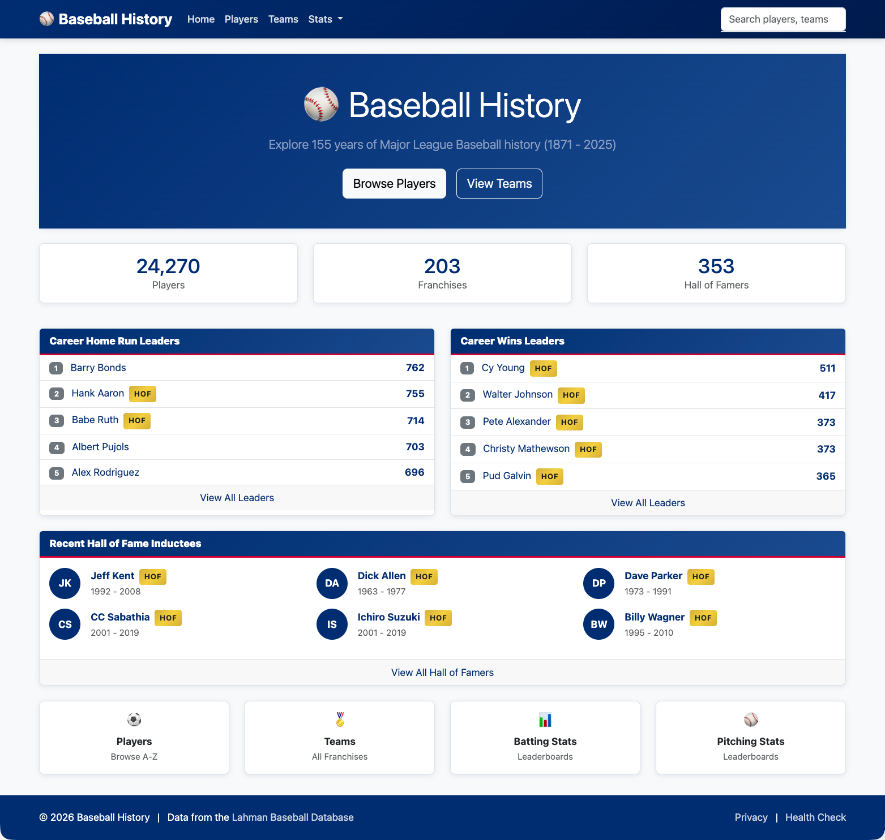

# Baseball History

**150 years of Major League Baseball you can browse, query, compare — and ask
an AI about. With the gaps in the historical record marked, not papered over.**

Baseball History covers 24,000+ players across 1871–2025, including the Negro
Leagues, built on the Lahman Baseball Database. Three things set it apart:

- **It's honest about what survived.** 453 players in this database are known
  only by a surname or an initial — mostly segregation-era Black baseball,
  where the record lived in weekly newspapers. Instead of rendering them like
  fully documented careers, the site marks them with a *Partial record* badge
  that links to [a feature page on why the record survived unevenly](./docs/FEATURES.md#partial-record-badge),
  and every leaderboard carries a plain statement that raw totals are not
  context-adjusted across eras.
- **AI assistants can query it directly.** A [Model Context Protocol server](./docs/MCP-SERVER-PLAN.md)
  exposes players, franchises, leaderboards, Hall of Fame history, and salary
  data as MCP tools and resources — speaking the current stateless Streamable
  HTTP revision, so Claude and other MCP clients can answer baseball questions
  against the real data.
- **Everything is open through a REST API.** 30+ JSON endpoints with no
  authentication — players, teams, leaders, awards voting, postseason,
  salaries, search — with an interactive Scalar explorer and OpenAPI spec.



## Table of Contents

- [Features](#features)
- [Technology Stack](#technology-stack)
- [Documentation](#documentation)
- [Getting Started](#getting-started)
- [Project Structure](#project-structure)

## Features

- **Player Browser & Modals** — alphabetical browsing, quick-view modals with
  batting, pitching, fielding, and postseason tabs
- **Player Comparison** — up to 4 players side by side with Chart.js
  visualizations and CSV export
- **Statistical Leaders** — batting and pitching leaderboards with
  season-relative qualification thresholds and era/league filters
- **Hall of Fame** — inductees by year and category, full voting history
- **Awards & Voting** — award winners with complete voting breakdowns
- **Postseason** — playoff series results from 1884 onward
- **Salary Explorer** — player salary history, team payrolls, salary leaders
- **Global Search** — players and teams across the entire history of the game
- **Data transparency** — partial-record badges, a data scope statement, and
  the Surviving Records feature page on segregation-era record survival

## Technology Stack

| Component | Technology                               |
|-----------|------------------------------------------|
| Backend   | ASP.NET Core 10.0, Razor Pages           |
| Database  | PostgreSQL (runtime) with Lahman data    |
| ORM       | Entity Framework Core 10.0               |
| Frontend  | htmxRazor 2.0.1, htmx 2.0.4, Bootstrap 5 |
| AI access | ModelContextProtocol 2.1 (MCP server)    |

The frontend uses htmx for SPA-feel navigation with no JavaScript framework;
local development is orchestrated with .NET Aspire.

## Documentation

- [Architecture Overview](./docs/ARCHITECTURE.md) - System architecture and design
  patterns
- [Database Design](./docs/DATABASE.md) - Database schema and Entity Framework
  configuration
- [PostgreSQL Migration Guide](./docs/POSTGRES-MIGRATION.md) - Configuration for
  local development (User Secrets) and Azure deployment (Key Vault)
- [MCP Server Guide](./docs/MCP-SERVER-PLAN.md) - Shipped MCP v1 surface,
  local setup, sample client config, and rollout boundaries
- [Frontend Design](./docs/FRONTEND.md) - htmx patterns, Bootstrap theming, and CSS
  architecture
- [Features](./docs/FEATURES.md) - Detailed feature documentation
- [API Reference](./docs/API.md) - Page models and data flow

## Getting Started

### Prerequisites

- .NET 10.0 SDK
- Access to a PostgreSQL database loaded with Lahman data
- Aspire CLI (`aspire`) for the orchestrated local development workflow

### Running the Application

Before starting the app, set a real `ConnectionStrings:Lahman` value outside git. For local development, use user-secrets:

```bash
dotnet user-secrets set --project baseball-history-web \
  "ConnectionStrings:Lahman" \
  "Host=<server>;Port=5432;Database=lahman;Username=<user>;Password=<local-password>;SSL Mode=Require;Trust Server Certificate=true"
```

See [POSTGRES-MIGRATION.md](./docs/POSTGRES-MIGRATION.md) for the full local and Azure setup story.

For local MCP setup and client adoption guidance, see the
[MCP Server Guide](./docs/MCP-SERVER-PLAN.md).

#### Preferred: Aspire AppHost orchestration

```bash
# Clone the repository
git clone <repository-url>
cd baseball-history

# Build the solution
dotnet build baseball-history.sln

# Start the Aspire AppHost
aspire start --apphost baseball-history-aspire/baseball-history-aspire.csproj

# Run the regression suite
dotnet test baseball-history-tests
```

Use `aspire describe --apphost baseball-history-aspire/baseball-history-aspire.csproj`
to see the dashboard URL and the dynamically assigned web endpoint for the `web`
resource.

#### Backward-compatible standalone web startup

```bash
# Run the web application without Aspire
dotnet run --project baseball-history-web
```

The Aspire AppHost is additive and does not replace the direct `dotnet run`
workflow for the existing web project.

### Runtime Configuration Notes

- The current runtime is PostgreSQL-backed and requires `ConnectionStrings:Lahman`.
- Local development should set that key with `dotnet user-secrets`.
- Azure App Service should provide the same key through configuration, ideally as a Key Vault reference backed by Managed Identity.
- No real passwords or full connection strings are committed to this repository.
- The Aspire AppHost only orchestrates `baseball-history-web` for local development; it does not change the web app's runtime contracts or require Aspire-specific code in the web project.
- htmxRazor still serves its foundation assets from `/_rhx/`, and response caching still varies by `HX-Request` so full-page and partial responses do not collide.

### Database

The application uses the [Lahman Baseball Database](https://www.seanlahman.com/baseball-archive/statistics/),
a comprehensive database of Major League Baseball statistics from 1871 to
present, loaded into PostgreSQL for runtime use.

`ConnectionStrings:Lahman` must point at that PostgreSQL database. The legacy
`lahman.db` SQLite file is historical migration input only; new local or Azure
setups should not rely on copying it into `baseball-history-web`.

## Project Structure

```
baseball-history/
├── baseball-history-aspire/       # Aspire AppHost for local orchestration
├── baseball-history-data/         # Shared EF Core models and query services
├── baseball-history-mcp/          # Model Context Protocol server
├── baseball-history-tests/        # Regression suite (unit + integration)
├── baseball-history-web/          # Main web application
│   ├── Api/                       # REST API endpoints and DTOs
│   ├── ViewModels/                # View models for pages
│   ├── Pages/                     # Razor Pages
│   │   ├── Players/               # Player browser and modals
│   │   ├── Teams/                 # Team/franchise browser
│   │   ├── Stats/                 # Statistical leaderboards
│   │   ├── Compare/               # Multi-player comparison
│   │   ├── HallOfFame/            # Hall of Fame browser
│   │   └── Shared/                # Layouts and components
│   ├── Services/                  # Shared services and helpers
│   ├── Extensions/                # Helper extensions (htmx, etc.)
│   ├── wwwroot/                   # Static files (CSS, JS)
│   └── Program.cs                 # Application entry point
└── docs/                          # Documentation
```

## License

This project uses the Lahman Baseball Database, which is available under the
Creative Commons Attribution-ShareAlike 3.0 Unported License. The site states
its data's limits plainly — see the data scope statement on the About page:
raw totals, no park factors or era adjustments, and partial surviving records
for the Negro Leagues.
